# Skilter – bruksanvisning

Skilter lager informasjonsskilt til trykk: et banner øverst, et kart med steder og veier, og kort med
bilde og tekst som er koblet til stedene med linjer. Du jobber rett i en mappe på PC-en, og skiltet
lagres automatisk.

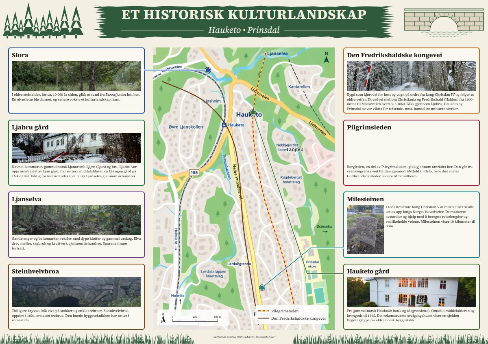

## Innhold

1. [Før du starter](#1-før-du-starter)
2. [Åpne prosjektet](#2-åpne-prosjektet)
3. [Skjermbildet](#3-skjermbildet)
4. [Kort: tekst og utseende](#4-kort-tekst-og-utseende)
5. [Bilder: bytte, beskjære og justere](#5-bilder-bytte-beskjære-og-justere)
6. [Stående bilder](#6-stående-bilder)
7. [Koble kort til kartet](#7-koble-kort-til-kartet)
8. [Kartet og målestokken](#8-kartet-og-målestokken)
9. [Veier og stier](#9-veier-og-stier)
10. [Stedsnavn og tegnforklaring](#10-stedsnavn-og-tegnforklaring)
11. [Banner, tema, oppsett og dekor](#11-banner-tema-oppsett-og-dekor)
12. [Lagring og angre](#12-lagring-og-angre)
13. [Eksport til trykk](#13-eksport-til-trykk)
14. [Tastatursnarveier](#14-tastatursnarveier)
15. [Vanlige spørsmål](#15-vanlige-spørsmål)

---

## 1. Før du starter

**Du trenger:** Google Chrome eller Microsoft Edge på PC. Andre nettlesere kan ikke åpne mapper.

**Lag en prosjektmappe** med dette innholdet:

| Hva                    | Eksempel                       | Merknad                                    |
| ---------------------- | ------------------------------ | ------------------------------------------ |
| Tekstene               | `tekst.txt`                    | Se oppsettet under                         |
| Kartet                 | `Kart.png`                     | Filnavnet må begynne med «kart»            |
| Én bildemappe per kort | `1 Slora/`, `2 Ljabru gård/` … | Starter med kortets nummer og et mellomrom |

Bilder kan være JPG, PNG, WebP, AVIF eller GIF, rett fra mobilen.

**Slik skriver du `tekst.txt`:**

```
ET HISTORISK KULTURLANDSKAP

1. Slora
I eldre steinalder, for ca. 10 000 år siden, gikk et sund fra Bunnefjorden inn her.

2. Ljabru gård
Navnet kommer av gammelnorsk *Ljanarbrú* …

Skrevet av Marius Park Pedersen, lokalhistoriker
```

- Første linje blir tittelen i banneret.
- `1. Navn` starter kort nummer 1. Teksten under hører til kortet. Tom linje gir nytt avsnitt.
- `*ord*` blir kursiv og `**ord**` blir fet.
- En linje som starter med «Skrevet av» blir forfatterlinja nederst på skiltet.

## 2. Åpne prosjektet

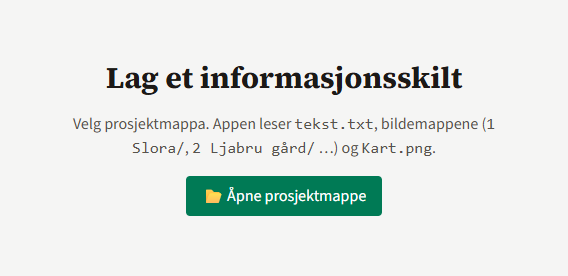

1. Trykk **📂 Åpne prosjektmappe** og velg mappa.
2. Chrome spør om appen får se og endre filer i mappa. Svar **Tillat**; appen må kunne lagre skiltet.
3. Første gang lager appen et kort per seksjon i `tekst.txt`, med første bilde fra kortets mappe.

Neste gang kan du trykke **Åpne «skilter» igjen**. Da åpnes skiltet slik du forlot det.

## 3. Skjermbildet

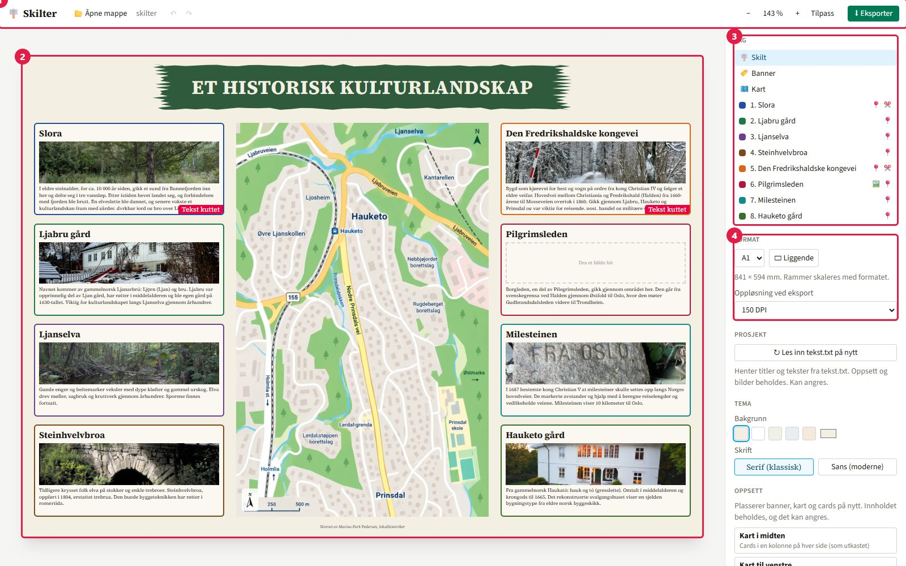

1. **Verktøylinja:** åpne mappe, angre (↶) og gjør om (↷), lagringsstatus, zoom og **⬇ Eksporter**.
2. **Skiltet:** klikk på noe for å velge det. Dra for å flytte, dra i hjørnene for å endre størrelse.
3. **Lag:** alt som finnes på skiltet – banner, kart, veier, dekor og kort. Klikk for å velge.
   Små ikoner viser hva som mangler: 🖼️ bilde, 📍 kobling til kartet, ✂️ tekst som ikke får plass.
4. **Egenskaper:** innstillinger for det som er valgt. Når ingenting er valgt, vises skiltets format,
   tema, oppsett og dekor.

**Zoom:** knappene − og + i verktøylinja, eller **Ctrl + scroll**. **Tilpass** viser hele skiltet.

**Format:** A0–A3, liggende eller stående. Alt på skiltet skaleres når du bytter format.

## 4. Kort: tekst og utseende

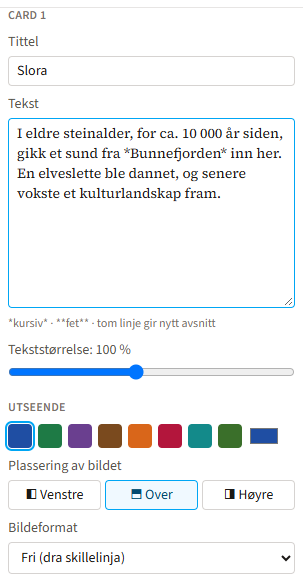

Velg et kort for å endre:

- **Tittel og tekst.** Skriv `*kursiv*` og `**fet**`, og tom linje for nytt avsnitt.
- **Tekststørrelse** for både tittel og tekst i kortet.
- **Farge** på rammen og linja til kartet. Velg en av fargene eller din egen.
- **Plassering av bildet:** ◧ til venstre, ⬒ over eller ◨ til høyre for teksten.
- **Bildeformat:** fast forhold (16:9, 3:2, 4:3, 1:1, 3:4, 2:3), «Som bildet» (ingenting skjæres
  bort) eller «Fri». Med «Fri» drar du den blå skillelinja mellom bilde og tekst.

> **«Tekst kuttet»** i hjørnet betyr at teksten ikke får plass. Gjør kortet større, bildet mindre,
> teksten mindre, eller kort ned teksten. Merket kommer ikke med på trykk.

Har du endret `tekst.txt` etter at du startet? Velg **🪧 Skilt** og trykk **↻ Les inn tekst.txt på
nytt**. Titler og tekster oppdateres, mens oppsett og bilder beholdes.

## 5. Bilder: bytte, beskjære og justere

### Bytte bilde

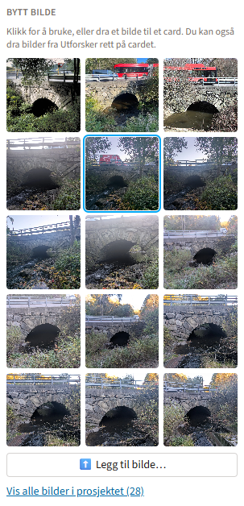

Under **Bytt bilde** ser du bildene i kortets mappe. Du kan:

- **klikke** på et bilde for å bruke det,
- **dra** et bilde fra lista til et hvilket som helst kort,
- **dra et bilde fra Utforsker** rett på kortet, eller trykke **⬆️ Legg til bilde…**. Bildet kopieres
  inn i kortets mappe. Har kortet ingen mappe, lages den (f.eks. `6 Pilgrimsleden/`).

**Vis alle bilder i prosjektet** viser bildene i de andre mappene også.

### Beskjære

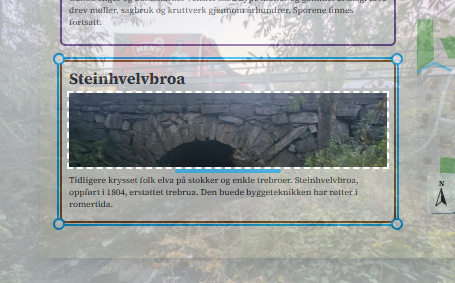

1. **Dobbelklikk** bildet i kortet (eller trykk **✂️ Beskjær**).
2. **Dra** i bildet for å flytte utsnittet. **Scroll** for å zoome. Delen utenfor ramma vises svakt.
3. Trykk **Esc**, dobbelklikk igjen eller trykk **✓ Ferdig med beskjæring**.

Originalfila endres aldri. Du kan alltid endre utsnittet eller trykke **Tilbakestill**.

### Justere

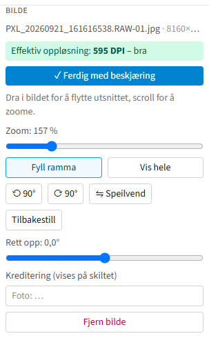

- **Zoom** med glidebryteren.
- **Fyll ramma** eller **Vis hele** bildet.
- **⟲ 90° / ⟳ 90°** roterer, **⇋ Speilvend** snur bildet, **Rett opp** retter skjev horisont (±10°).
- **Kreditering** («Foto: …») vises i hjørnet av bildet på skiltet.

**Effektiv oppløsning** viser hvor skarpt bildet blir på trykk: grønt er bra, gult kan bli uskarpt
(under 200 DPI) og rødt blir tydelig uskarpt (under 120 DPI). Zoomer du mye inn i et lite bilde, faller
oppløsningen.

## 6. Stående bilder

Når bildet er stående og ligger over teksten, foreslår appen å legge det ved siden av:

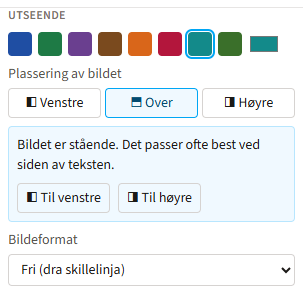

Trykk **◧ Til venstre** eller **◨ Til høyre**. Appen setter da bildeformatet til «Som bildet», så hele
bildet vises, og lar tittelen gå over hele bredden.

| Bildet til høyre                                        | Bildet til venstre                                          |
| ------------------------------------------------------- | ----------------------------------------------------------- |
| 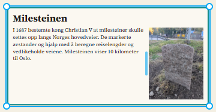 | 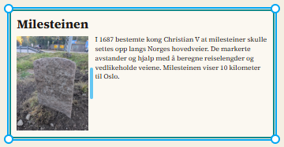 |

Skru av **Tittel over hele bredden** hvis tittelen skal stå ved siden av bildet i stedet.

## 7. Koble kort til kartet

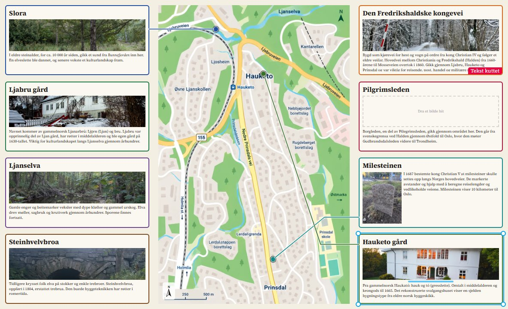

1. Velg kortet.
2. Trykk **📍 Plasser punkt på kartet** og klikk på stedet i kartet.
3. En markør i kortets farge og en linje fra kortet til markøren dukker opp.

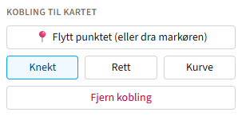

- **Dra markøren** for å flytte punktet.
- Velg linje: **Knekt**, **Rett** eller **Kurve**. Linja festes automatisk til siden av kortet som
  vender mot punktet.
- **Fjern kobling** tar bort linja og punktet.

Appen varsler hvis punktet havner utenfor den synlige delen av kartet.

## 8. Kartet og målestokken

Velg **🗺️ Kart**. Da kan du:

- **scrolle** i kartet for å zoome og **dra** for å flytte kartbildet,
- flytte kartrammen med **✥ Kart**-håndtaket øverst og endre størrelse i hjørnene,
- trykke **Ramme etter bildet** for å gi rammen samme form som kartbildet.

Markører, veier og stedsnavn følger kartbildet når du zoomer og flytter.

### Kalibrere målestokken

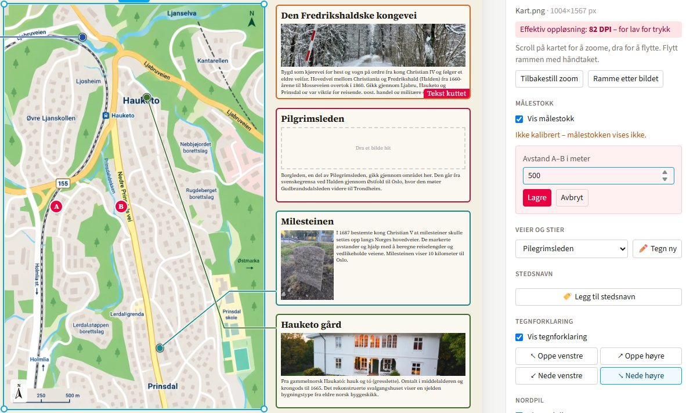

1. Trykk **📏 Kalibrer målestokk**.
2. Klikk på to punkter **A** og **B** med kjent avstand. Har kartet sin egen målestokk, klikk på
   «0» og «500 m».
3. Skriv avstanden i meter og trykk **Lagre**.

Målestokken vises nederst til venstre i kartet sammen med nordpila. Nordpila kan roteres hvis kartet
ikke er nordvendt.

## 9. Veier og stier

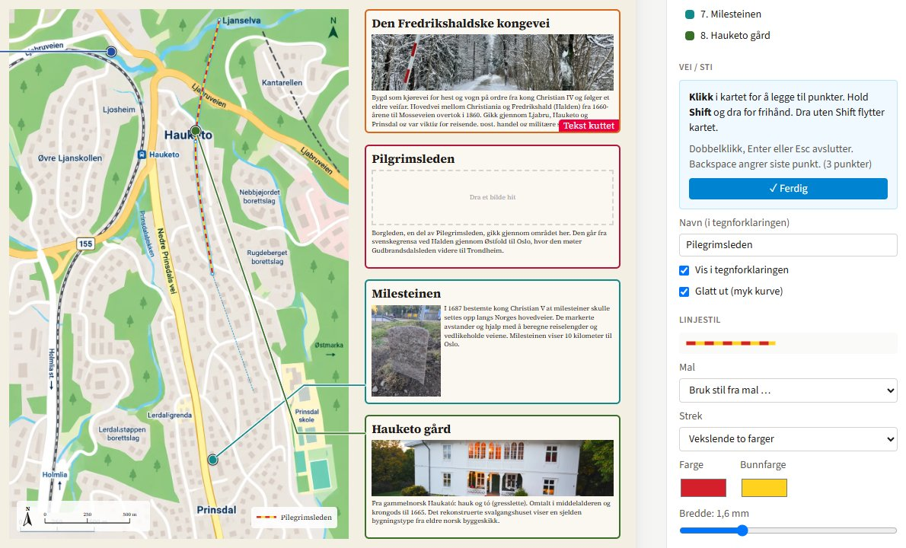

1. Velg **🗺️ Kart**, velg stil under **Veier og stier** (f.eks. Pilegrimsleden) og trykk **✏️ Tegn ny**.
2. **Klikk** i kartet for hvert punkt. En stiplet linje følger musepekeren fra siste punkt.
3. **Hold Shift og dra** for å tegne frihånd. Vanlig dra flytter kartet mens du tegner.
4. **Backspace** fjerner siste punkt.
5. **Dobbelklikk**, **Enter** eller **Esc** avslutter.

**Endre en vei:** klikk på den for å velge den.

- **Dra et punkt** for å flytte det.
- **Klikk på linja** for å sette inn et nytt punkt.
- **Dobbelklikk et punkt** for å slette det.
- **✏️ Tegn videre** fortsetter fra siste punkt, og **⇄ Snu retning** snur veien.

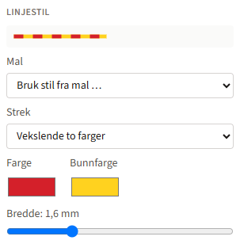

**Linjestil:** heltrukken, stiplet, prikket, vekslende to farger (som rød og gul pilegrimsled) eller
dobbel strek. Velg farger og bredde. Bredden er i millimeter på det ferdige skiltet. **Glatt ut** gjør
veien til en myk kurve.

## 10. Stedsnavn og tegnforklaring

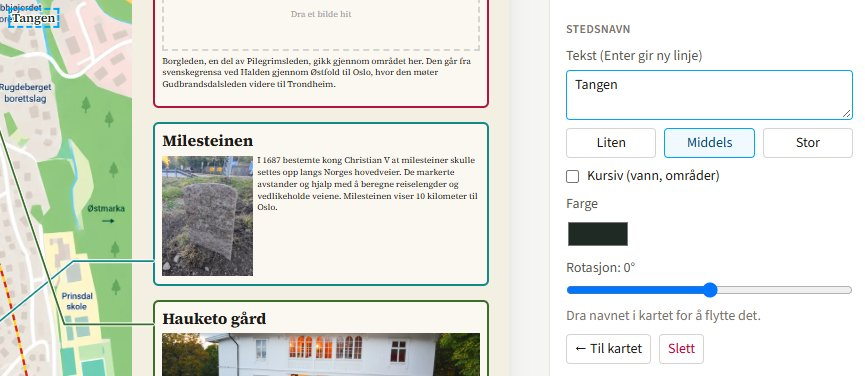

**Stedsnavn:** velg **🗺️ Kart**, trykk **🏷️ Legg til stedsnavn** og klikk der navnet skal stå. Skriv
navnet (Enter gir ny linje) og velg størrelse, kursiv (for vann og områder), farge og rotasjon. Dra
navnet i kartet for å flytte det.

**Tegnforklaring:** lages automatisk av veiene som har **Vis i tegnforklaringen** på. Navnet på veien
brukes som tekst. Under **Tegnforklaring** i kartpanelet velger du hjørne, eller skjuler den.

## 11. Banner, tema, oppsett og dekor

### Banner

| Banneret                        | Innstillinger                                           |
| ------------------------------- | ------------------------------------------------------- |
| 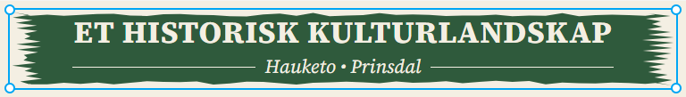 | 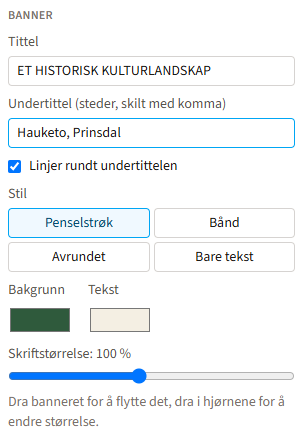 |

Velg **🏷️ Banner** i lista. Du kan endre tittel og undertittel (skriv steder med komma, f.eks.
«Hauketo, Prinsdal»), skru linjene rundt undertittelen av og på, og velge stil: **Penselstrøk**,
**Bånd**, **Avrundet** eller **Bare tekst**. Velg farger og skriftstørrelse. Banneret flyttes og
endres i størrelse som alt annet.

### Tema, oppsett og dekor

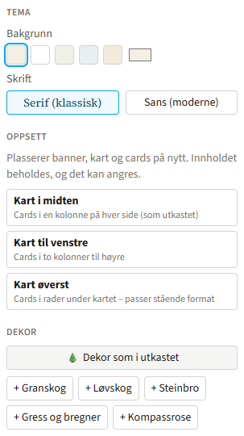

Velg **🪧 Skilt**:

- **Tema:** bakgrunnsfarge og skrift – serif (klassisk) eller sans (moderne).
- **Oppsett:** plasserer banner, kart og kort på nytt.
  - **Kart i midten:** kort i en kolonne på hver side, som utkastet.
  - **Kart til venstre:** kort i to kolonner til høyre.
  - **Kart øverst:** kort i rader under kartet – passer stående format.
- **Dekor:** **🌲 Dekor som i utkastet** legger inn trær, bro og gress. Du kan også legge til granskog,
  løvskog, steinbro, gress og kompassrose hver for seg.

Velg en dekor i lista for å endre farge, speilvende, få **🎲 Ny variant**, duplisere eller slette den.
Dekor ligger alltid bak kort, kart og banner.

## 12. Lagring og angre

**Alt lagres automatisk** i `skilt.json` i prosjektmappa, rett etter hver endring. Verktøylinja viser
«✓ Lagret» med klokkeslett. Nettleseren advarer hvis du lukker før lagringen er ferdig. Ligger mappa i
Dropbox eller OneDrive, får du sikkerhetskopi automatisk.

**Angre og gjør om:** ↶ og ↷ i verktøylinja, eller **Ctrl + Z** og **Ctrl + Y**. En hel dra-bevegelse
er ett steg, og hvert klikk er et eget steg. I tekstfelt angrer Ctrl + Z skrivingen i feltet.

## 13. Eksport til trykk

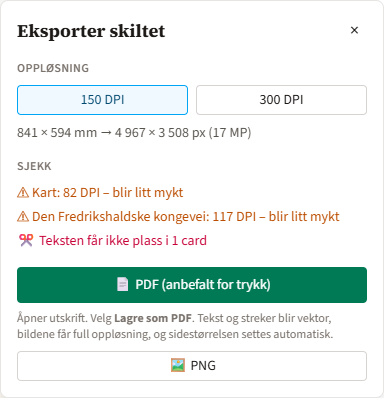

Trykk **⬇ Eksporter**.

1. **Velg oppløsning:** 150 DPI holder for store skilt som leses på avstand, 300 DPI for nærlesing.
2. **Se på «Sjekk»:** bilder som blir uskarpe og kort der teksten ikke får plass.
3. **Velg format:**
   - **📄 PDF (anbefalt for trykk):** utskriftsvinduet åpnes. Velg **Lagre som PDF** som skriver og
     trykk **Lagre**. Sidestørrelsen settes automatisk til skiltets størrelse uten marger. Tekst og
     streker blir skarpe i alle størrelser.
   - **🖼️ PNG:** bildet lagres i mappa `eksport/` i prosjektmappa. PNG er sperret for A0 i 300 DPI
     fordi bildet blir for stort for nettleseren; bruk PDF der.

Håndtak, markeringer og varsler som «Tekst kuttet» kommer ikke med i eksporten.

> **Tips til trykkeriet:** Send PDF-en. Oppgi format (f.eks. A1, 841 × 594 mm) og at fila er uten
> skjæremerker og utfallende bakgrunn.

## 14. Tastatursnarveier

| Tast                            | Hva skjer                                    |
| ------------------------------- | -------------------------------------------- |
| Ctrl + Z                        | Angre                                        |
| Ctrl + Y eller Ctrl + Shift + Z | Gjør om                                      |
| Ctrl + scroll                   | Zoom visningen                               |
| Scroll i valgt kart eller bilde | Zoom kartet eller bildet                     |
| Dobbelklikk på bilde            | Start eller avslutt beskjæring               |
| Esc                             | Avslutt beskjæring, tegning eller plassering |
| Enter                           | Avslutt tegning av vei                       |
| Backspace (under tegning)       | Fjern siste punkt                            |
| Shift + dra (under tegning)     | Tegn frihånd                                 |

## 15. Vanlige spørsmål

**Kartet eller et bilde er merket rødt i «Sjekk».**
Bildet har for få piksler for størrelsen det har på skiltet. Bruk en større versjon av bildet, zoom
mindre inn, eller gjør bilderammen mindre. For kartet trenger du en større fil eller en PDF/SVG-versjon.

**Et kort mangler bilde.**
Dra et bilde fra Utforsker rett på kortet. Appen lager mappa for kortet hvis den ikke finnes.

**Jeg ser ikke endringene jeg gjorde i `tekst.txt`.**
Skiltet lagres i `skilt.json` og leser ikke `tekst.txt` automatisk på nytt. Velg **🪧 Skilt** og trykk
**↻ Les inn tekst.txt på nytt**.

**Jeg vil begynne helt på nytt.**
Lukk appen, slett eller gi nytt navn til `skilt.json` i prosjektmappa, og åpne mappa igjen. Skiltet
lages da på nytt fra `tekst.txt` og bildemappene.

**Appen sier at nettleseren ikke støtter mappetilgang.**
Bruk Chrome eller Edge på PC.

**Fonten ser annerledes ut i PDF-en.**
Det skal ikke skje; appen bygger inn fontene. Oppstår det likevel, eksporter på nytt i Chrome og meld
fra om hvilken tekst det gjelder.
