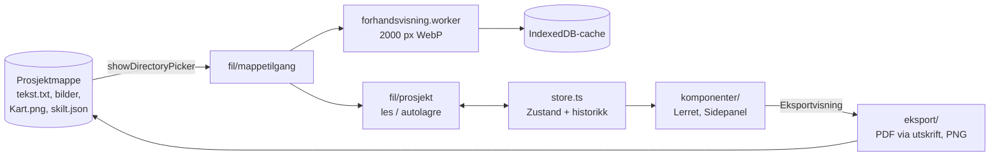
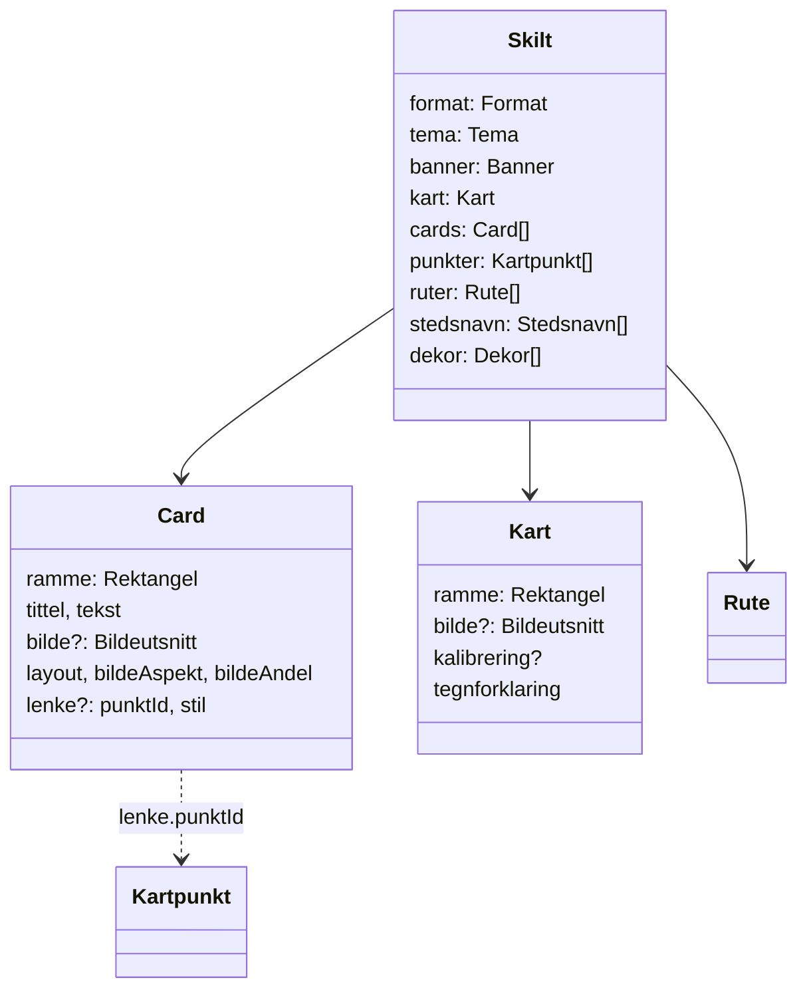

# Skilter – teknisk beskrivelse

Skilter er en nettleserapp for å lage trykkferdige informasjonsskilt: banner, kart med punkter og veier,
og cards (tittel, bilde, tekst) koblet til steder på kartet med linjer. Appen kjører lokalt i Chrome eller
Edge på PC, leser og skriver direkte i en prosjektmappe, og eksporterer PDF og PNG i trykkoppløsning.

Denne beskrivelsen er for utviklere. Brukerveiledningen ligger i [BRUKSANVISNING.md](BRUKSANVISNING.md).

## Innhold

1. [Oversikt](#1-oversikt)
2. [Kom i gang](#2-kom-i-gang)
3. [Mappestruktur](#3-mappestruktur)
4. [Prosjektmappa og filformater](#4-prosjektmappa-og-filformater)
5. [Datamodell](#5-datamodell)
6. [Koordinatsystemer og geometri](#6-koordinatsystemer-og-geometri)
7. [Tilstand, angre og lagring](#7-tilstand-angre-og-lagring)
8. [Bilder og forhåndsvisninger](#8-bilder-og-forhåndsvisninger)
9. [Gjengivelse og eksport](#9-gjengivelse-og-eksport)
10. [Testing](#10-testing)
11. [Kjente begrensninger](#11-kjente-begrensninger)
12. [Videre arbeid](#12-videre-arbeid)

---

## 1. Oversikt

| Lag           | Valg                                                               |
| ------------- | ------------------------------------------------------------------ |
| Språk og bygg | TypeScript 6, React 19, Vite 8                                     |
| Stil          | Tailwind CSS 4                                                     |
| Tilstand      | Zustand 5 (én store)                                               |
| Filtilgang    | File System Access API (`showDirectoryPicker`)                     |
| Lokal cache   | IndexedDB via `idb-keyval`                                         |
| PNG-eksport   | `modern-screenshot` (DOM → canvas) + egen pHYs-skriver             |
| PDF-eksport   | Nettleserens utskrift med `@page` lik skiltets størrelse           |
| Fonter        | Source Serif 4 / Source Sans 3, Noto Serif / Noto Sans som reserve |
| Tester        | Vitest (enhet), Playwright mot installert Chrome (E2E)             |

Det finnes ingen server. All data ligger i prosjektmappa brukeren åpner, pluss en cache i nettleseren.



## 2. Kom i gang

```sh
pnpm install
pnpm dev          # http://localhost:5330
pnpm test         # enhetstester (Vitest)
pnpm test:e2e     # E2E (Playwright, bruker installert Chrome – ingen nedlasting)
pnpm lint         # Biome (lint + formatering), pnpm format retter
pnpm build        # typesjekk og produksjonsbygg til dist/
```

**Demomodus (kun dev):** `http://localhost:5330/?demo` åpner mappa over `app/` uten mappevelger.
Vite-pluginen i [vite-prosjekt.ts](../vite-prosjekt.ts) serverer fillista (`/__prosjekt/filer`) og filene
(`/__prosjekt/fil/<sti>`). Demoen lagrer i IndexedDB i stedet for på disk; `?demo&ny` starter fra
`tekst.txt` igjen. E2E-testene bruker demomodus fordi mappevelgeren er en systemdialog.

**Illustrasjoner til bruksanvisningen:** `DOKUMENTASJON=1 pnpm test:e2e dokumentasjon` lager bildene i
`docs/bilder/` på nytt.

**Vite-cache:** `cacheDir` ligger i systemets temp-mappe. Inne i Dropbox låste synkroniseringen
`node_modules/.vite` når Vite byttet ut mappa (EBUSY). `node_modules` er i tillegg merket som ignorert i
Dropbox (`com.dropbox.ignored`).

## 3. Mappestruktur

```
src/
├── main.tsx              Oppstart: fonter, autolagring, gestsporing, demomodus
├── App.tsx               Verktøylinje, arbeidsflate (zoom), tastatursnarveier
├── store.ts              Zustand-store: all tilstand og alle handlinger
├── modell/               Rene data og regler, uten React
│   ├── typer.ts          Datamodellen (Skilt, Card, Kart, Rute …)
│   ├── tekstParser.ts    tekst.txt → tittel, seksjoner, forfatter
│   ├── importerMappe.ts  Prosjektmappe → nytt Skilt
│   ├── oppsett.ts        Formater, farger, oppsettmaler, standardbanner
│   ├── lagring.ts        skilt.json: serialisering og migrering
│   ├── historikk.ts      Angre/gjør om og gestsporing
│   ├── riktekst.ts       *kursiv* og **fet**
│   └── rutestiler.ts     Maler for veistiler, stedsnavnstørrelser
├── geometri/             Ren matematikk, godt dekket av tester
│   ├── utsnitt.ts        Bildeutsnitt: zoom, panorering, rotasjon, klemming
│   ├── card.ts           Bilderamme i card, skillelinje, lenkelinjer
│   ├── rute.ts           Stier, utglatting, strekstiler, forenkling (RDP)
│   ├── malestokk.ts      Kalibrering og «pene» målestokklengder
│   ├── dekor.ts          Prosedyrisk SVG-dekor (skog, bro, gress, kompass)
│   └── banner.ts         Penselstrøk og bånd
├── fil/                  Alt som berører filsystem og cache
│   ├── mappetilgang.ts   Lese/skrive i prosjektmappa, demomappe
│   ├── prosjekt.ts       Åpne prosjekt, autolagring
│   ├── forhandsvisning.ts         Kø og cache for forhåndsvisninger
│   └── forhandsvisning.worker.ts  Skalering i Web Worker
├── komponenter/          React-komponenter
│   ├── visning.tsx       Kontekst: editor- eller eksportvisning
│   ├── Lerret.tsx        Skiltet
│   ├── Flyttbar.tsx      Flytt/skaler-ramme med håndtak
│   ├── Bildevisning.tsx  Bilde i ramme med utsnitt, beskjæringsmodus
│   ├── CardVisning.tsx, KartRamme.tsx, KartLag.tsx, LenkeOverlegg.tsx,
│   │   BannerVisning.tsx, DekorVisning.tsx
│   └── Sidepanel.tsx, CardPanel.tsx, RutePanel.tsx, UtseendePanel.tsx, Skjema.tsx
└── eksport/
    ├── eksport.ts        Pikselmål, filnavn, vent på bilder, lagring
    ├── png.ts            CRC32 og pHYs (DPI) i PNG
    └── EksportPanel.tsx  Dialog, kvalitetssjekk, PNG- og PDF-jobb
e2e/                      Playwright-tester og illustrasjonsskript
docs/                     Denne fila, bruksanvisning og bilder
```

Reglene er skilt ut i `modell/` og `geometri/` slik at de kan testes uten nettleser. Komponentene leser
tilstand fra storen og kaller handlinger; de inneholder lite logikk selv.

## 4. Prosjektmappa og filformater

```
skilter/                       ← mappa brukeren åpner
├── tekst.txt                  Titler og tekster
├── Kart.png                   Kartbildet (første bilde på toppnivå som starter med «kart»)
├── 1 Slora/                   Bilder til seksjon 1
├── 2 Ljabru gård/ …           Én mappe per seksjon, «<nummer> <navn>»
├── skilt.json                 Prosjektet (skrives av appen)
├── eksport/                   PNG-eksport (skrives av appen)
└── app/                       Selve appen (hoppes over ved lesing)
```

Appen leser toppnivået og ett nivå ned. Mappene `app`, `eksport`, `node_modules`, `.git`, `dist` og
skjulte mapper hoppes over. Bildeformater: JPG, PNG, WebP, AVIF og GIF.

### tekst.txt

```
ET HISTORISK KULTURLANDSKAP        ← første ikke-tomme linje: tittel

1. Slora                           ← «N. Navn» starter seksjon N
I eldre steinalder …               ← tekst til neste seksjon; tom linje = nytt avsnitt

Skrevet av …                       ← linje som starter med «Skrevet av»: forfatter
```

Seksjon N kobles til mappa som starter med `N ` (tallet sammenlignes, så `1` treffer ikke `10 …`).
Første bilde i mappa (alfabetisk) blir standardbilde. [tekstParser.ts](../src/modell/tekstParser.ts).

### skilt.json

```json
{ "app": "skilter", "versjon": 1, "lagret": "2026-09-25T19:47:00.000Z", "skilt": { … } }
```

`skilt` er `Skilt`-objektet slik det står i [typer.ts](../src/modell/typer.ts). Bilder refereres med
relativ sti i prosjektmappa, så mappa kan flyttes. [lagring.ts](../src/modell/lagring.ts) fyller inn
standardverdier for felt som mangler (eldre filer) og avviser filer fra en nyere versjon.
**Nye felt skal alltid få en standardverdi i `lesSkilt`**; testen i `lagring.test.ts` sjekker dette.

## 5. Datamodell



Hovedregler:

- **Alle mål på skiltet er i millimeter** (`Rektangel` = `x, y, b, h`). Skjermpiksler finnes bare i
  komponentene.
- **Posisjoner i kartet er `Bildepunkt`** med `x, y` i 0–1 relativt til kartbildet. Kartpunkter, ruter
  og stedsnavn følger derfor bildet når kartet zoomes, panoreres eller rammen flyttes.
- **Bilder endres aldri.** `Bildeutsnitt` beskriver hvordan originalfila vises:
  `{ fil, sentrumX, sentrumY, zoom, rotasjon, speilvendt, tilpass, kreditering }`.
- **Kartpunkt er skilt fra Card.** Et card lenker til et punkt (`lenke.punktId`). Når kobling fjernes,
  fjernes punktet hvis ingen andre bruker det.
- **Card-layout:** `bilde-over`, `bilde-venstre` eller `bilde-hoyre`. Bildets størrelse bestemmes av
  `bildeAspekt` (`16:9` … `2:3`, `bilde` = bildets egne proporsjoner, `fri` = `bildeAndel`).

## 6. Koordinatsystemer og geometri

### Skjerm ↔ skilt

`visningsskala` i storen er skjermpiksler per mm. Komponentene regner `px = mm × skala` via
`useSkala()`. Ved eksport settes skalaen til `dpi / 25.4` (PNG) eller `96 / 25.4` (utskrift), slik at
de samme komponentene tegner skiltet i trykkstørrelse ([visning.tsx](../src/komponenter/visning.tsx)).

### Bildeutsnitt ([utsnitt.ts](../src/geometri/utsnitt.ts))

`plasser(utsnitt, ramme, bilde)` gir bildets plassering i ramma:

1. **Effektiv ramme:** ved rotasjon θ er rammens omsluttende boks i bildets retning
   `b' = b·|cos θ| + h·|sin θ|`, `h' = b·|sin θ| + h·|cos θ|`.
2. **Skala:** «fyll» bruker `max(b'/bildeB, h'/bildeH) × zoom`, «vis hele» bruker `min(…)`.
3. **Plassering:** bildepunktet `(sentrumX, sentrumY)` legges midt i ramma. Bildet tegnes urotert og
   roteres rundt rammens sentrum.
4. **Klemming:** `klem()` holder zoom i [1, 8] og sentrum slik at den effektive rammen alltid ligger
   innenfor bildet. Ramma blir derfor aldri tom, heller ikke ved skrå rotasjon.

`zoomRundt()` holder punktet under musepekeren i ro, og `panorer()` roterer dra-bevegelsen inn i
bildets retning. `bildepunktTilRamme()` og `rammeTilBildepunkt()` er inverse, også med rotasjon og
speilvending. Dette brukes av kartpunkter, ruter, stedsnavn og kalibrering. Effektiv DPI er
`25.4 / skala` (kildepiksler per tomme på skiltet).

### Cards og lenkelinjer ([card.ts](../src/geometri/card.ts))

- Mål i cardet skalerer med cardets bredde (`u = bredde / 235`), så tekst og kanter følger formatet.
- `bildeRammeForCard(card, naturligAspekt)` gir bilderammens størrelse ut fra layout og format.
  Stående bilder over teksten blir smalere i stedet for å fylle høyden.
- `lenkeanker()` velger kanten som vender mot punktet. `lenkesti()` lager rett, knekt eller kurvet
  SVG-sti og slutter litt før markøren.

### Ruter ([rute.ts](../src/geometri/rute.ts))

- Utglatting: Catmull-Rom omregnet til kubiske Bézier-kurver (kurven går gjennom alle punktene).
- Frihånd: punkter samles med minst 0,8 mm mellomrom og forenkles med Ramer–Douglas–Peucker (0,6 mm).
- Strekstiler blir ett eller flere strøk oppå hverandre (`strekLag`); linjebredder er i mm på trykk.
- Klikk på valgt rute setter inn punkt i segmentet som er nærmest (`naermesteSegment`).

### Målestokk ([malestokk.ts](../src/geometri/malestokk.ts))

Kalibrering lagrer to bildepunkter og avstanden i meter. Meter per kildepiksel × kildepiksler per mm
gir meter per mm på skiltet. Lengden rundes ned til nærmeste «pene» tall (1, 2, 2,5 og 5 × 10ⁿ).

### Dekor og banner

[dekor.ts](../src/geometri/dekor.ts) tegner skog, bro, gress og kompass som SVG-stier i rammens
størrelse, med en frøbasert tilfeldighetsgenerator (mulberry32). Samme frø gir alltid samme tegning, så
dekoren endrer seg ikke ved omlasting. [banner.ts](../src/geometri/banner.ts) lager penselstrøk og bånd
i et fast koordinatsystem (1000 × 200) som strekkes over bannerrammen.

## 7. Tilstand, angre og lagring

### Store ([store.ts](../src/store.ts))

Én Zustand-store med `skilt`, `mappe`, `valg` (hva som er markert), `modus` (normal, kalibrer,
plasser-punkt, beskjær, tegn-rute, plasser-stedsnavn), `visningsskala`, `historikk`, `lagring` og
`tekstOverflyt`. Alle endringer av skiltet går gjennom handlinger i storen og lager nye objekter
(ingen mutering), slik at historikk og lagring kan sammenligne med `===`.

`velg()` avslutter modus som hører til et annet element: beskjæring avsluttes når et annet card
velges, og tegning avsluttes (og tomme ruter fjernes) når noe annet velges.

### Angre ([historikk.ts](../src/modell/historikk.ts))

En `subscribe` på storen legger forrige `skilt` i historikken ved hver endring. Endringer i samme
**gest** slås sammen til ett steg: ett trykk med dra (flytte card, dra glidebryter) eller skriving i
samme felt. Hvert nytt `pointerdown`, og hvert tastetrykk i et nytt element, starter en ny gest. En pause
over 2 sekunder gir også nytt steg. Historikken holder maks 100 steg og tømmes når et prosjekt åpnes.

> Første versjon slo sammen alle endringer innen 600 ms. Da ble raske, separate klikk til ett angresteg.
> Gestsporingen løser dette.

### Autolagring ([prosjekt.ts](../src/fil/prosjekt.ts))

Lagring startes 800 ms etter siste endring og køes, så to lagringer aldri skriver samtidig. Status vises
i verktøylinja («Endret», «Lagrer …», «Lagret 21:12», «Ikke lagret: …»). `beforeunload` advarer hvis
lagring pågår. Ekte mapper skriver `skilt.json` med `FileSystemWritableFileStream`; demomappa skriver til
IndexedDB. Mappehåndtaket lagres i IndexedDB, så «Åpne igjen» bare trenger ny tillatelse.

## 8. Bilder og forhåndsvisninger

Mobilbildene er ca. 10 MB hver. [forhandsvisning.ts](../src/fil/forhandsvisning.ts):

1. Nøkkel `sti | størrelse | endringstid`, så endrede filer får ny forhåndsvisning.
2. Finnes nøkkelen i IndexedDB, brukes den lagrede WebP-en.
3. Ellers skaleres bildet i en av to Web Workers med `createImageBitmap` og `OffscreenCanvas` til maks
   2000 px, og lagres som WebP (kvalitet 0,85) sammen med originalens mål.

`createImageBitmap` følger EXIF-orientering, så stående mobilbilder vises riktig vei. Originalens mål
brukes til utsnitt og DPI; forhåndsvisningen bare til visning. Ved eksport velger `Bildevisning`
originalfila når forhåndsvisningen er for liten for valgt DPI, eller når originalen uansett er liten.

## 9. Gjengivelse og eksport

### Én komponentgren, to visninger

`Lerret` tegnes både i editoren og ved eksport. `Eksportvisning` (kontekst) setter skala og DPI, og
gjør at `useValg()` og `useModus()` alltid gir «ingenting valgt» og «normal». Da forsvinner håndtak,
markeringer, noder, tegneflate, «Tekst kuttet» og tomme bildefelt uten egne eksportkomponenter.
Elementer som bare hører til editoren er i tillegg merket `data-kun-editor`.

### PDF ([EksportPanel.tsx](../src/eksport/EksportPanel.tsx))

1. Skiltet tegnes i en portal `#utskrift` med 96/25,4 px per mm, altså 1 mm på skjerm = 1 mm på papir.
2. Et `<style>`-element setter `@page { size: <B>mm <H>mm; margin: 0 }`, skjuler resten av appen ved
   utskrift og tvinger bakgrunner med `print-color-adjust: exact`.
3. Når alle bilder er lastet og dekodet, kalles `window.print()`. Dokumenttittelen settes til
   filnavnet, som Chrome foreslår ved «Lagre som PDF». `afterprint` rydder opp.

Resultatet har vektortekst, innebygde fonter og bilder i full oppløsning. E2E-testen kontrollerer
én side, riktig MediaBox, at Source Serif er innebygd og at Times ikke brukes.

> **Fonter i PDF:** Chrome byttet ut den variable fonten med Times ved utskrift. Appen bruker derfor
> statiske fontfiler. Source Serif mangler «ǫ» (brukt i norrøne navn), så Noto Serif ligger som reserve.

### PNG

`modern-screenshot` tegner lerretet utenfor skjermen med `dpi / 25,4` px per mm til et canvas.
Lerretets størrelse rundes til hele piksler, så bildet får nøyaktig `mm / 25,4 × dpi` piksler. PNG-fila
får en pHYs-blokk med DPI ([png.ts](../src/eksport/png.ts)). Med ekte mappe lagres fila i `eksport/`,
ellers lastes den ned. PNG sperres over 150 megapiksler (A0 ved 300 DPI er 139 MP og ligger nær Chromes
grense for canvas); PDF anbefales for store formater.

### Kvalitetssjekk

Før eksport viser dialogen bilder med effektiv DPI under 80 % av valgt oppløsning, og cards der teksten
ikke får plass (målt med `ResizeObserver` i `Brodtekst`).

## 10. Testing

| Lag   | Hvor               | Innhold                                                                                                                                                                                      |
| ----- | ------------------ | -------------------------------------------------------------------------------------------------------------------------------------------------------------------------------------------- |
| Enhet | `src/**/*.test.ts` | Parser, import, oppsettmaler (alle maler × formater), utsnitt med rotasjon, lenker, ruter, målestokk, dekor innenfor rammen, lagring og migrering, historikk, store-handlinger, PNG-metadata |
| E2E   | `e2e/*.spec.ts`    | Åpne mappe, beskjære, koble punkt, tegne og redigere veier, stedsnavn, autolagring og omlasting, angre, PNG-størrelse og DPI, PDF-sidestørrelse, stående bilder, banner, tema, dekor         |

E2E-testene kjører mot demomodus i installert Chrome (`channel: 'chrome'`). Skjermbilder tas bare når
`SKJERMBILDER=<mappe>` er satt. Illustrasjonsskriptet (`dokumentasjon.spec.ts`) hoppes over uten
`DOKUMENTASJON=1`.

Regler: ingen `any`, rene funksjoner i `modell/` og `geometri/` skal ha tester, og UI-flyt testes med
roller og etiketter (`getByRole`, `getByLabel`). Knappegrupper bruker `role="group"` i stedet for
`<label>`, ellers får første knapp gruppens navn.

## 11. Kjente begrensninger

- **Bare Chrome og Edge på PC:** File System Access API finnes ikke i Firefox og Safari.
- **Kartet er et bilde:** Kartverket-kart (MapLibre) og veier som følger stier er ikke laget.
- **PNG i A0 ved 300 DPI** er sperret; bruk PDF.
- **PDF krever et klikk** på «Lagre som PDF» i utskriftsdialogen.
- **Tittelhøyde er beregnet for én linje** når tittelen går over hele bredden ved siden-bilde.
- **Tekst som ikke får plass** kuttes; appen varsler, men krymper ikke teksten automatisk.
- **Nye bilder i demomodus** holdes bare i minnet.

## 12. Videre arbeid

Fra [PLAN.md](../PLAN.md), fase 6: nettkart (MapLibre + Kartverket) med ruting langs stier,
bildejustering (lysstyrke, kontrast, metning), stedsnavnsøk mot Kartverket, samt automatisk tilpasning
av tekststørrelse, hjelpelinjer og «fest til» ved flytting.
